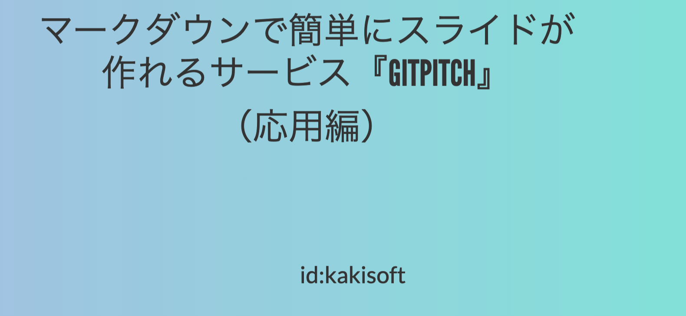
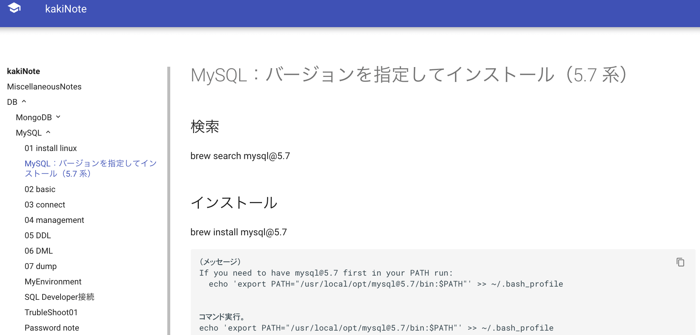
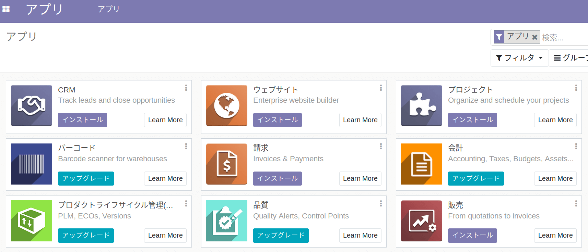

### エンジニアの働き方について
### と
### 手持ちの武器の有効利用

---
### 自己紹介

  <table style="white-space: nowrap;border-style: none;">
    <tr>
      <td>@size[0.75em](**名前**)</td>
      <td>
        <ruby>
        <rb>@size[0.95em](垣花　暁)</rb>
        <rp>（</rp>
        <rt>かきのはな　さとる</rt>
        <rp>）</rp>
        </ruby>
        　@fa[twitter fa-0.3x][@size[0.7em](kakisoft_tab)](https://twitter.com/kakisoft_tab)
      </td>
    </tr>
    <tr>
      <td>@size[0.75em](**出身**)</td>
      <td>@size[0.95em](沖縄県)</td>
    </tr>
    <tr>
      <td>@size[0.75em](**仕事**)</td>
      <td>@size[0.95em](物流系エンジニア) @size[0.7em](（フリーランス）)</td>
    </tr>
    <tr>
      <td>@size[0.75em](**使う**)</td>
      <td>@size[0.95em](.NET/Java/PHP/RDB全般)</td>
    </tr>
    <tr>
      <td>&nbsp;</td>
      <td>@size[0.95em](物流業界向けの言語や機器)</td>
    </tr>
    <tr>
      <td>@size[0.75em](**趣味**)</td>
      <td>@size[0.95em](リアル脱出ゲーム)</td>
    </tr>
  </table>

---
エンジニアは、他の職業と比較して  
大きな特徴があると思っています。
---
それは、  
　  
@size[1.1em](「自分の知見を外部に公開しやすい。」)  
　  
という事。
---
例えば・・・
---
ブログ書いたり  
  
[https://kakistamp.hatenadiary.jp/](https://kakistamp.hatenadiary.jp/)
---
技術情報共有サービスに投稿したり  
  
[https://qiita.com/kakisoft](https://qiita.com/kakisoft)
---
スライドを公開したり  
  
[https://gitpitch.com/kakisoft/HowToUseGitPitch3](https://gitpitch.com/kakisoft/HowToUseGitPitch3)
---
できる事は様々です。
---
こういうのがきっかけで、  
自身の仕事に繋がったりもします。
---
他にも、業務効率化のための工夫を  
自前で色々できるのも大きな特徴だと思っています。
---
例えば
---
どこでも見れる、  
自分用の汎用的技術メモを残したり・・・
  
[https://kakisoft.github.io/MiscellaneousDocs](https://kakisoft.github.io/MiscellaneousDocs)
---
効率化のためのスクリプトを用意し、  
どこからでも使えるようにしたり・・・  
  
[https://github.com/kakisoft/MyTrivialTools](https://github.com/kakisoft/MyTrivialTools)
---
自前のライブラリを作成したり
---
出来る事は様々です。
---
使用するツールの選択肢も、
他の業種の方々よりも  
幅が広いのではないかと思います。
---
例えば、オープンソースのアプリを  
自前の環境に用意できたりします。
---
プロジェクト管理ツールだったり  
  
---
ERPアプリケーションだったり
  
---
無数の選択肢があります。
---
色々ありましたが、最近  
　  
@size[1.2em](「エンジニアって、こんな特徴があるんじゃ？」)  
　  
というのが１点あります。
---
それは、  
　  
@size[1.2em](『エンジニアのスキルは、他の専門スキルと交換可能』)  
　  
ではないかと言う事。
---
どういう事かというと
---
最近、人狼ゲームの用語集を作りました。  
  
[https://kakisoft.github.io/WerewolfGameInEnglish](https://kakisoft.github.io/WerewolfGameInEnglish)
---
「英語で人狼ゲームをプレイする」  
というコミュニティにて、紙で配布されていた  
用語集をWeb化しました。
---
結構好評で、「こうしたらもっといい！」といった、  
改善案が色々と出てきました。
---
その過程で、英語が堪能な  
コミュニティ主催者から、  
英語を学ぶ事ができています。
---
また、受けられるフィードバックも  
エンジニアの視点では気づきにくいものも多いので、  
非常に有益だと感じる事も多いです。
---
そう言った感じで、  
　  
「自分の持っているスキルを提供する代わりに、  
相手の専門知識を提供してもらう」  
　  
という行為が、エンジニアには  
実行しやすいのではないかと思いました。
---
エンジニアとしてのスキルを伸ばすだけでなく、  
多方面のスキルを吸収していく事で、  
新たな選択肢を広げていくというのも、  
いいキャリア形成になるのではないでしょうか。
---
おわり
